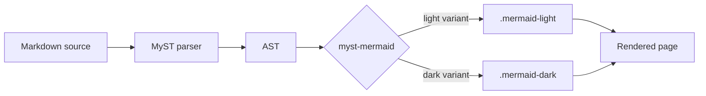

# myst-mermaid

A Python executable MyST plugin that pre-processes mermaid diagrams in
the AST: it emits each diagram twice (once with the user-configured
light theme, once forced into `theme: dark`) wrapped in
`.mermaid-light` and `.mermaid-dark` containers. The toolkit's
[CSS](../capabilities/styling.md) hides whichever variant doesn't match
the active color scheme.

This page builds with the plugin enabled. The diagram below is a live
example — toggle your OS or browser color scheme to see both variants.

## Live example



In light mode you see the diagram rendered with the toolkit's default
theme. In dark mode the `.mermaid-dark` variant takes over with
Mermaid's `theme: dark` applied.

## Install

In your site's `myst.yml`:

```yaml
project:
  plugins:
    - type: executable
      path: _toolkit/plugins/myst-mermaid/plugin.py
```

Python dependencies (one-time, system-wide or in your build venv):

```bash
pip install pyyaml jsonschema
```

`jsonschema` is optional — if missing, schema validation is silently
skipped.

## Configure

Drop a `myst-mermaid.yml` at your project root. Every key is passed to
mermaid.js as a config value, EXCEPT for these reserved plugin-level
keys:

| Key | Type | Default | Purpose |
|---|---|---|---|
| `dual_render` | bool | `true` | Emit light + dark variants. Set false for single render per diagram. |
| `config_file` | string | — | Path to an external YAML file with extra mermaid config. Inline keys override. |

Example:

```yaml
dual_render: true

# Mermaid config follows. See https://mermaid.js.org/config/
theme: default
fontFamily: "sans-serif"
themeVariables:
  primaryColor: '#1f2937'
  primaryTextColor: '#f9fafb'
  lineColor: '#9ca3af'

logLevel: fatal
```

Per-diagram overrides go in a YAML frontmatter at the top of the
mermaid block's body:

````markdown
```{mermaid}
---
config:
  theme: forest
---
graph LR
  A --> B
```
````

## What gets emitted

For `dual_render: true`, each mermaid block becomes:

```html
<div class="mermaid-dual-container">
  <div class="mermaid-light"><!-- mermaid block with light theme --></div>
  <div class="mermaid-dark"><!-- mermaid block with theme: dark --></div>
</div>
```

Labels and IDs from the original mermaid node are hoisted to the
container, so MyST cross-references continue to resolve.

For `dual_render: false`, you get a single mermaid block with the
merged config applied. No container wrapping; no CSS toggling needed.

## How it works inside

1. MyST hands the plugin a JSON-serialized AST on stdin.
2. The plugin walks the tree looking for `mermaid` nodes, `code` blocks
   with `lang: mermaid`, or `{mermaid}` directive nodes.
3. For each match, it parses the body's inline frontmatter (if any),
   deep-merges with the global `myst-mermaid.yml` config, validates
   against the Mermaid config JSON schema (best-effort), and produces
   the dual-container shape.
4. Writes the transformed AST back to stdout.

## Limitations

- The plugin runs at the AST stage. It doesn't actually render the
  diagrams — that's still Mermaid's job, done client-side at page load.
  The plugin just ensures both light and dark versions reach the page
  with the right config.
- Schema validation is best-effort. If `jsonschema` isn't installed or
  the schema fails to fetch, validation is skipped silently.
- The toolkit's CSS uses `html.dark`, `[data-theme="dark"]`, and
  `prefers-color-scheme: dark` to detect mode. If your theme uses a
  different mechanism, layer additional rules over the toolkit CSS.

## Styling and fonts

The plugin's companion CSS lives at
[`plugins/myst-mermaid/css/mermaid.css`](https://github.com/snap2insight/myst-docs-toolkit/blob/main/plugins/myst-mermaid/css/mermaid.css).
It ships:

- A Google Fonts import for **Architects Daughter** (handwritten look).
  Forced onto mermaid text via `.mermaid text { font-family: ... !important; }`.
- CSS variables exposing a professional light + dark color palette
  (purple accents, low-glare grays). Available for downstream overrides.
- The `.mermaid-light` / `.mermaid-dark` visibility-toggle rules.

This CSS is also mirrored into the toolkit's `css/site.css` so
consumers who load the toolkit's main stylesheet get the mermaid
styling automatically. If you want only the plugin's CSS without the
rest of the toolkit, point `shared-theme.yml` at
`_toolkit/plugins/myst-mermaid/css/mermaid.css` instead.

To change the font: redefine `--mermaid-font-family` in your own CSS
layered after the toolkit's.

## Related

- Plugin source: [`plugins/myst-mermaid/plugin.py`](https://github.com/snap2insight/myst-docs-toolkit/blob/main/plugins/myst-mermaid/plugin.py)
- Companion CSS: [`plugins/myst-mermaid/css/mermaid.css`](https://github.com/snap2insight/myst-docs-toolkit/blob/main/plugins/myst-mermaid/css/mermaid.css)
- Example config: [`plugins/myst-mermaid/examples/myst-mermaid.example.yml`](https://github.com/snap2insight/myst-docs-toolkit/blob/main/plugins/myst-mermaid/examples/myst-mermaid.example.yml)
- Mermaid config reference: [mermaid.js.org/config](https://mermaid.js.org/config/)
