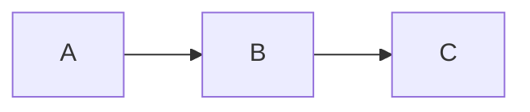

# myst-mermaid

A generic MyST executable plugin that pre-processes Mermaid diagrams in
the AST, optionally rendering each diagram twice (once with the
configured light theme, once forced to `theme: dark`) so the site looks
right in both light and dark mode. CSS shipped in the parent toolkit's
`css/site.css` hides the variant that doesn't match the active color
scheme.

No company branding, no organization-specific knobs — pure MyST + Mermaid.

## Install

In your MyST project's `myst.yml`:

```yaml
project:
  plugins:
    - type: executable
      path: _toolkit/plugins/myst-mermaid/plugin.py
```

(If your project doesn't symlink the toolkit at `_toolkit/`, point at
wherever you've placed `myst-mermaid/plugin.py`.)

Python dependencies (the plugin is one Python file plus two libraries):

```bash
pip install pyyaml jsonschema
```

`jsonschema` is optional; if missing, schema validation is silently
skipped.

## Configure

Drop a `myst-mermaid.yml` at your project root. Every key in this file
is passed to mermaid.js as a config value, EXCEPT for these two reserved
plugin-level keys:

| Key | Type | Default | Purpose |
|---|---|---|---|
| `dual_render` | bool | `true` | When true, emits light + dark variants per diagram. When false, single render. |
| `config_file` | string | — | Path to an external YAML file with mermaid config. Inline keys override file keys. |

See [`examples/myst-mermaid.example.yml`](examples/myst-mermaid.example.yml)
for a starter config.

The plugin walks parent directories from the current working directory
to find `myst-mermaid.yml`, so a config at your monorepo root applies to
nested docs sites too.

## Use

Standard MyST Mermaid syntax — both fenced code blocks and `{mermaid}`
directives are recognized:

````markdown

````

Per-diagram overrides go in a frontmatter block at the top of the body:

````markdown
```{mermaid}
---
config:
  theme: forest
---
graph LR
  A --> B
```
````

## What gets emitted

For `dual_render: true`, each mermaid block becomes:

```html
<div class="mermaid-dual-container">
  <div class="mermaid-light"> <!-- mermaid block with light-theme config --> </div>
  <div class="mermaid-dark">  <!-- mermaid block with theme: dark forced --> </div>
</div>
```

The toolkit's `site.css` shows `.mermaid-light` and hides `.mermaid-dark`
by default, then flips them based on `html.dark` / `prefers-color-scheme:
dark`. Labels and IDs from the original mermaid node are hoisted onto
the container so cross-references still resolve.

For `dual_render: false`, you just get one mermaid block with the merged
config applied.

## CSS

Dual-render visibility, the Architects Daughter font import, light/dark
color-palette CSS variables, and a `.mermaid text` font override live at
[`css/mermaid.css`](css/mermaid.css). This file is **also mirrored into
the toolkit's `css/site.css`**, so consumers who use the toolkit's
generic stylesheet get the mermaid styling for free.

If your site only wants the mermaid plugin's CSS (without the toolkit's
generic block-kind / button / footer rules), point your
`shared-theme.yml` at this file instead of `css/site.css`:

```yaml
site:
  options:
    style: _toolkit/plugins/myst-mermaid/css/mermaid.css
```

The dual mirroring exists because MyST's `site.options.style` only
accepts a single CSS path — a future change can replace this with an
array reference if MyST gains support.

## Files

```
myst-mermaid/
├── plugin.py                          — the plugin (single Python file)
├── mermaid.schema.json                — cached Mermaid config schema
├── css/
│   └── mermaid.css                    — companion CSS (also in toolkit's site.css)
├── examples/
│   └── myst-mermaid.example.yml       — starter config to copy
└── README.md                          — this file
```

## License

MIT — matches the parent `myst-docs-toolkit` repo.
